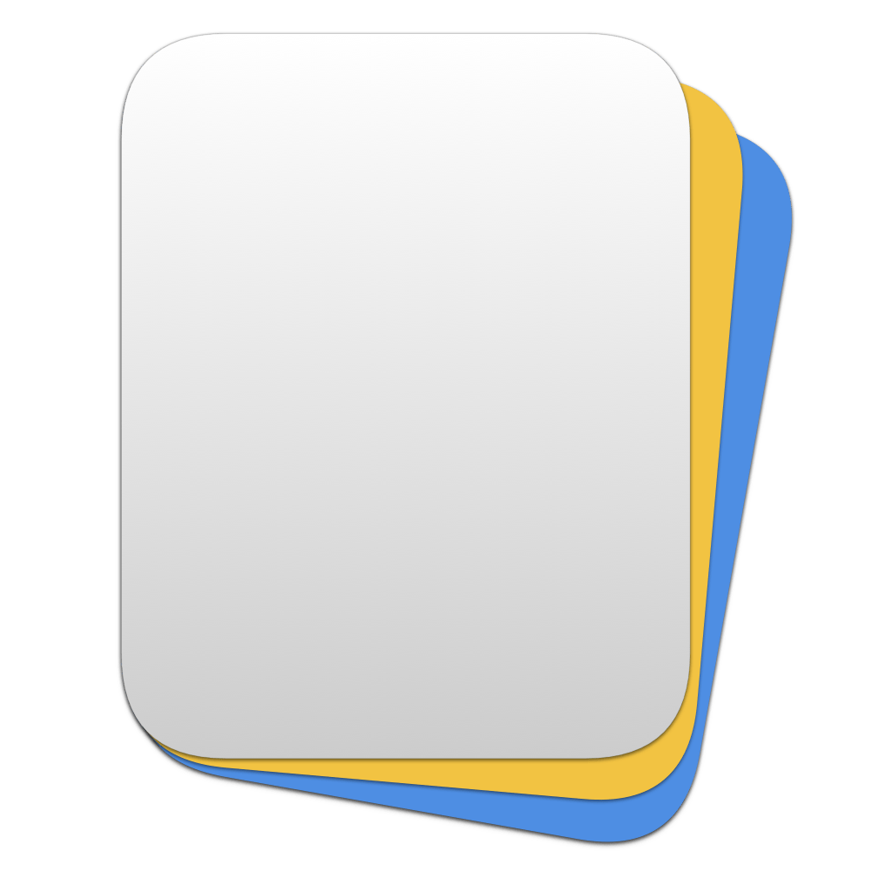

<p align="center">
    
</p>

<p align="center">
    
    
    
    <a href="https://danielsaidi.github.io/DeckKit"></a>
    
</p>


# DeckKit

DeckKit is a SwiftUI SDK that helps you build deck-based apps. It has a `DeckView` that can render a deck of items with support for swipe gestures, edge swipes, shuffling, etc.

<p align="center" style="border-radius: 10px">
    
</p>

DeckKit can be customized to great extent. You can change colors, fonts, etc. and use completely custom views. It also has tools to manage favorites.


## Installation

DeckKit can be installed with the Swift Package Manager:

```
https://github.com/danielsaidi/DeckKit.git
```


## Getting started

With DeckKit, you can create a `Deck` of any model that conform to `DeckItem`:

```swift
struct Hobby: DeckItem {
    
    var name: String
    var text: String

    var id: String { name }
}
```

You can display a deck of cards with any of the built-in views, like a `DeckView`:

```swift
struct MyView: View {

    @State 
    var hobbies: [Hobby] = ...

    var body: some View {
        DeckView($hobbies) { hobby in
            RoundedRectangle(cornerRadius: 25.0)
                .fill(.blue)
                .overlay(Text(hobby.name))
                .shadow(radius: 10)
        }
    }
}
```

See the online [getting started guide][Getting-Started] for more information.


## Documentation

The online [documentation][Documentation] has more information, articles, code examples, etc.


## Demo Application

The `Demo` folder has an app that lets you explore the library on iOS, macOS, and visionOS.


## Support my work 

You can [sponsor me][Sponsors] on GitHub Sponsors or [reach out][Email] for paid support, to help support my [open-source projects][OpenSource].

Your support makes it possible for me to put more work into these projects and make them the best they can be.


## Contact

Feel free to reach out if you have questions or want to contribute in any way:

* Website: [danielsaidi.com][Website]
* E-mail: [daniel.saidi@gmail.com][Email]
* Bluesky: [@danielsaidi@bsky.social][Bluesky]
* Mastodon: [@danielsaidi@mastodon.social][Mastodon]


## License

DeckKit is available under the MIT license. See the [LICENSE][License] file for more info.


[Email]: mailto:daniel.saidi@gmail.com

[Website]: https://www.danielsaidi.com
[GitHub]: https://www.github.com/danielsaidi
[Bluesky]: https://bsky.app/profile/danielsaidi.bsky.social
[Twitter]: https://www.twitter.com/danielsaidi
[Mastodon]: https://mastodon.social/@danielsaidi
[Sponsors]: https://github.com/sponsors/danielsaidi
[OpenSource]: https://www.danielsaidi.com/opensource

[Documentation]: https://danielsaidi.github.io/DeckKit/
[Getting-Started]: https://danielsaidi.github.io/DeckKit/documentation/deckkit/getting-started

[License]: https://github.com/danielsaidi/DeckKit/blob/master/LICENSE
