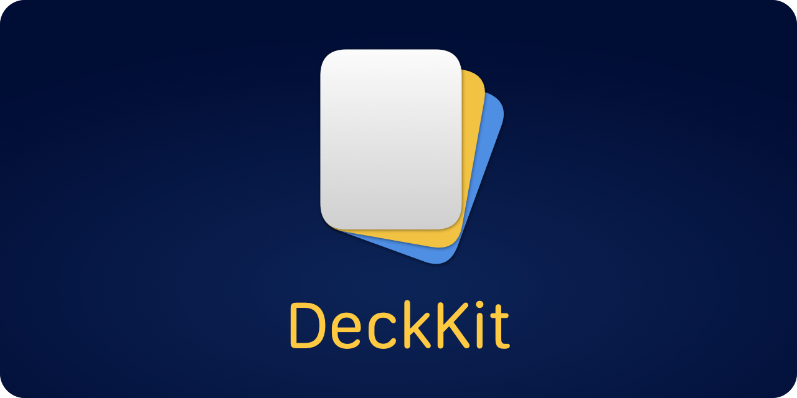

<p align="center">
    
</p>

<p align="center">
    
    
    
        <a href="https://twitter.com/danielsaidi">
        
    </a>
    <a href="https://mastodon.social/@danielsaidi">
        
    </a>
</p>


## About DeckKit

DeckKit helps you create deck-based apps in `SwiftUI`. The result can look like this or completely different:

<p align="center" style="border-radius: 10px">
    
</p>

DeckKit decks can be customized to great extent. You can change colors, fonts, corner radius etc. of the standard card views, and also use completely custom views.

DeckKit supports `iOS 13`, `macOS 11`, `tvOS 13` and `watchOS 6`.


## Installation

DeckKit can be installed with the Swift Package Manager:

```
https://github.com/danielsaidi/DeckKit.git
```

If you prefer to not have external dependencies, you can also just copy the source code into your app.


## Getting started

The online documentation has a [getting-started guide][Getting-Started] that will help you get started with the library.

In DeckKit, a `Deck` can be used to define a deck of items that implement the `DeckItem` protocol.

For instance, consider a `Hobby` type that looks like this:

```swift
struct Hobby: DeckItem {
    
    var name: String
    var text: String

    var id: String { name }
}
```

You can now create a deck with hobbies and display it in a `DeckView`:

```swift
struct MyView: View {

    @State
    var deck = Deck(
        name: "Hobbies",
        items: [
            Hobby(name: "Music", text: "I love music!"), 
            Hobby(name: "Movies", text: "I also love movies!"), 
            Hobby(name: "Programming", text: "Not to mention programming!")
        ]
    )

    var body: some View {
        DeckView(deck: $deck) {
            // Create a view for the hobby here
        }.padding()
    }
}
```

The `DeckView` takes an optional `DeckViewConfiguration` parameter that can be used to configure the view in various ways. You can for instance use it to control the visual direction, the number of visible items, etc. 

You can also provide additional actions that should be triggered when a card is dragged to the leading, trailing, top and bottom edges.

For more information, please see the [online documentation][Documentation] and [getting started guide][Getting-Started].


## Documentation

The [online documentation][Documentation] has articles, code examples etc. that let you overview the various parts of the library. 


## Demo Application

This project has a demo app that lets you explore the library on iOS and macOS. To try it out, just open and run `Demo/Demo.xcodeproj`.


## Support this library

You can sponsor this project on [GitHub Sponsors][Sponsors] or get in touch for paid support. 


## Contact

Feel free to reach out if you have questions or if you want to contribute in any way:

* Website: [danielsaidi.com][Website]
* Mastodon: [@danielsaidi@mastodon.social][Mastodon]
* Twitter: [@danielsaidi][Twitter]
* E-mail: [daniel.saidi@gmail.com][Email]


## License

DeckKit is available under the MIT license. See the [LICENSE][License] file for more info.


[Email]: mailto:daniel.saidi@gmail.com
[Website]: https://www.danielsaidi.com
[Twitter]: https://www.twitter.com/danielsaidi
[Mastodon]: https://mastodon.social/@danielsaidi
[Sponsors]: https://github.com/sponsors/danielsaidi

[Documentation]: https://danielsaidi.github.io/DeckKit/documentation/deckkit/
[Getting-Started]: https://danielsaidi.github.io/DeckKit/documentation/deckkit/getting-started
[License]: https://github.com/danielsaidi/DeckKit/blob/master/LICENSE
